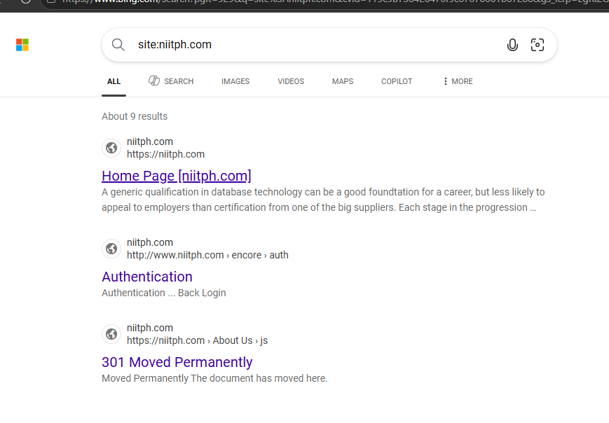
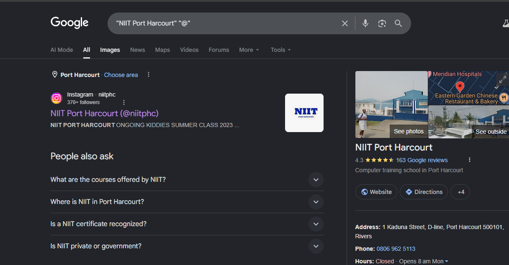
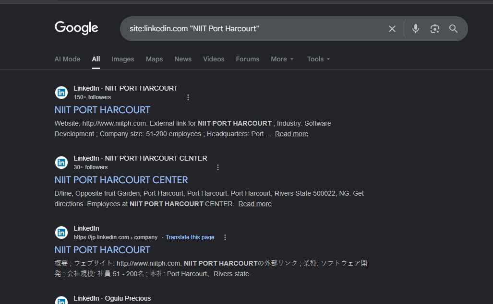
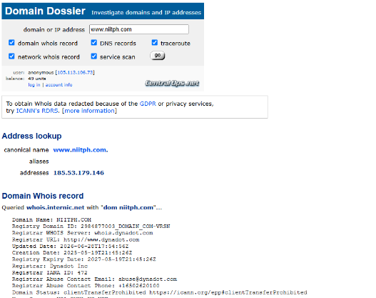
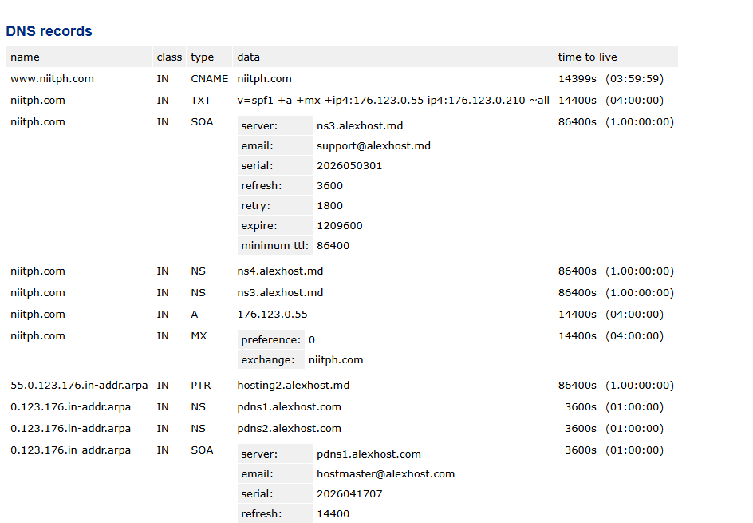
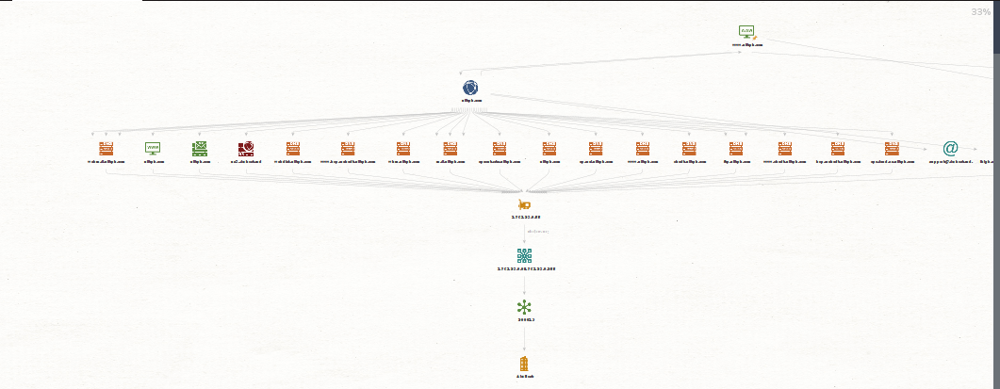
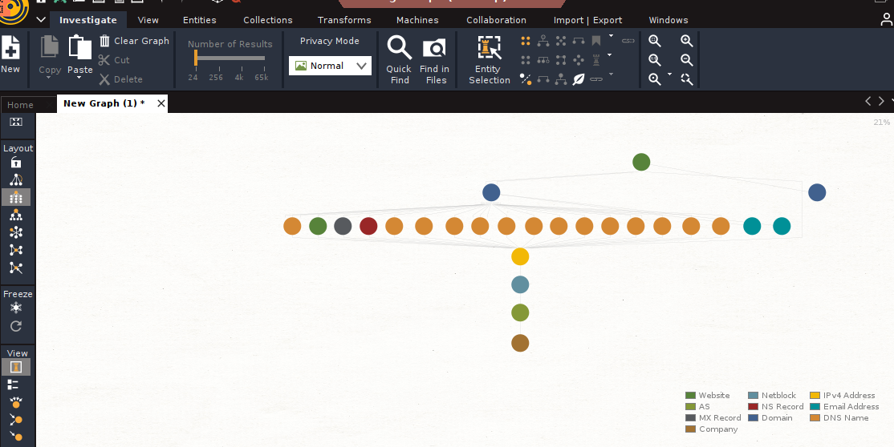
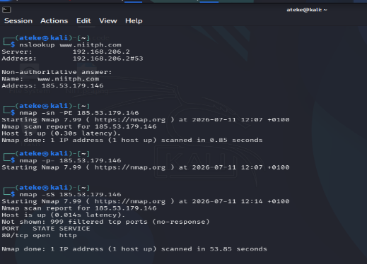

**ENTERPRISE INTELLIGENCE ASSESSMENT**

*Open-Source Exposure and Security Intelligence*

**Primary Subject of Assessment:**

**National Institute of Information Technology, Port Harcourt (NIITPH)**

Prepared by: Ateke Tamunonengieofori

Classification: Confidential — For Academic and Internal Review Use Only

Date: 10 July 2026

## Table of Contents

1. [Introduction](#1-introduction)
2. [Overview](#2-overview)
3. [Objectives](#3-objectives)
4. [Scope](#4-scope)
5. [Tools Used](#5-tools-used)
6. [Methodology](#6-methodology)
7. [Findings](#7-findings)
8. [Intelligence Correlation](#8-intelligence-correlation)
9. [Intelligence Assessment](#9-intelligence-assessment)
10. [Risk Analysis](#10-risk-analysis)
11. [Recommendations](#11-recommendations)
12. [Reference](#12-reference)

# **1. Introduction**

This assessment applies Open-Source Intelligence (OSINT) and network
reconnaissance techniques to evaluate organizational exposure of the
National Institute of Information Technology, Port Harcourt (NIITPH).
The objective is to identify publicly available information, analyze
infrastructure visibility, and determine potential risks from an
attacker's perspective.

The assessment scenario involves NIITPH experiencing suspicious login
attempts and increased visibility, indicating possible reconnaissance
activity by threat actors.

In addition to the organizational assessment of NIITPH, the source
material also includes a smaller, separate OSINT case study examining
the public exposure of a named lecturer through a different
institution's website (Wigwe University). This case study is presented
in the Findings section as an independent illustration of OSINT
technique and information persistence; no relationship between this
individual case and NIITPH was stated in the source material, and none
is assumed here.

# **2. Overview**

This report presents the results of an open-source intelligence (OSINT)
and light network-reconnaissance exercise. It combines a short
individual-level case study (a lecturer's public profile at Wigwe
University) with a structured organizational assessment of the National
Institute of Information Technology, Port Harcourt (NIITPH).

Using passive techniques — search-engine dorking, WHOIS lookup, Wayback
Machine review, and public social-platform review (LinkedIn, Instagram)
— together with a limited amount of active reconnaissance (an OSINT
Framework IP lookup and an Nmap host/port scan), the assessment surfaced
publicly exposed staff identities and contact details, an
unauthenticated login portal, domain and DNS configuration details, and
a set of network services reachable on NIITPH's hosting IP address.
Collectively, these findings describe an organization with a meaningful
public "footprint" that could be leveraged by a threat actor during the
reconnaissance phase of an attack.

# **3. Objectives**

- To identify publicly available information

- Assess employees' and organizational exposure

- Discover digital assets and footprints

- Investigate publicly available infrastructure

- Correlate intelligence findings into meaningful conclusions

- Assess security risks based on collected intelligence

- Produce a professional intelligence report

*In the NIITPH-specific portion of the assessment, this was additionally
framed as: to identify publicly exposed organizational assets, analyze
infrastructure visibility, and assess potential vulnerabilities using
OSINT and network scanning tools.*

# **4. Scope**

Based on the activity recorded in the Findings section, the scope of
this assessment covered:

- Two named web targets: the Wigwe University public website (individual
  case study) and the NIITPH public web presence (niitph.com, with a
  related reference to niit.com).

- Passive, unauthenticated OSINT collection only: search-engine dorking,
  WHOIS/registration lookup, Wayback Machine archive review, and public
  social-platform review (LinkedIn, Instagram).

- One instance of light active reconnaissance: an Nmap host-discovery
  and port scan of NIITPH's resolved IP address, 176.123.0.55.

- Entity and relationship mapping of the niitph.com domain using
  Maltego.

No credential testing, exploitation, social engineering, or intrusive
scanning beyond the single Nmap scan described above was recorded in the
source material. Any activity not explicitly reflected in the Findings
section should be treated as outside the scope of what was performed.

# **5. Tools Used**

| **Tool**        | **Purpose**                            |
|-----------------|----------------------------------------|
| Google Dorking  | Advanced search                        |
| Whois           | Domain information                     |
| TheHarvester    | Email and subdomain discovery          |
| Wayback Machine | Historical website analysis            |
| Maltego         | Relationship mapping                   |
| Httrack         | Offline website analysis               |
| Shodan          | Internet-facing asset discovery        |
| OSINT Framework | Domain / infrastructure reconnaissance |
| Gantt Project   | Planning                               |

*Table 1 — Tools referenced in the source material and their stated
purpose.*

# **6. Methodology**

The overall assessment followed the intelligence cycle methodology to
ensure a structured and repeatable intelligence process:

- Planning

- Collection

- Processing

- Analysis

- Dissemination

# **7. Findings**

The findings below consolidate all evidence and observations recorded in
the source material, organized by activity. Corresponding screenshots
are provided in the Evidence column of each row.

Risk Level values map each finding to its corresponding MITRE ATT&CK®
Reconnaissance (TA0043) technique, rather than a subjective
High/Medium/Low label:

- T1589 — Gather Victim Identity Information (employee names, roles,
  email addresses)

- T1590 — Gather Victim Network Information (IP addresses, network
  topology, infrastructure relationships)

- T1593 — Search Open Websites/Domains (general search-engine discovery)

- T1594 — Search Victim-Owned Websites (site-restricted dorking, current
  and archived site content)

- T1595 — Active Scanning (host discovery and port scanning)

- T1596 — Search Open Technical Databases (WHOIS/DNS registration data)

<table>
<colgroup>
<col style="width: 56%" />
<col style="width: 9%" />
<col style="width: 34%" />
</colgroup>
<thead>
<tr class="header">
<th><strong>Finding</strong></th>
<th><strong>Risk Level</strong></th>
<th><strong>Evidence</strong></th>
</tr>
</thead>
<tbody>
<tr class="odd">
<td colspan="3"><strong>A. Individual OSINT Case Study — Wigwe
University Lecturer Profile</strong></td>
</tr>
<tr class="even">
<td>A Google dork (intitle:wigwe university) was used to locate the
official Wigwe University website, www.wigweuniversity.edu.ng, as the
starting point for identifying a named lecturer's public profile.</td>
<td><strong>T1593</strong></td>
<td>

<em>Fig. A1 — Google dork search results identifying the university's
official website.</em>
</td>
</tr>
<tr class="odd">
<td>A review of the current Wigwe University website, including the
College of Science and Computing section where the lecturer's details
previously appeared, returned no profile information, indicating the
profile has since been removed from the live site.</td>
<td><strong>T1594</strong></td>
<td>

<em>Fig. A2 — Current university website; lecturer profile no longer
present.</em>
</td>
</tr>
<tr class="even">
<td>Using the Wayback Machine, an archived snapshot of the university
website dated 6 August 2025 was located and found to still contain the
lecturer's profile, confirming her prior affiliation with the
institution despite the removal from the current site.</td>
<td><strong>T1594</strong></td>
<td>

<em>Fig. A3 — Wayback Machine archived snapshot (6 Aug 2025)
retaining the lecturer's profile.</em>
</td>
</tr>
<tr class="odd">
<td colspan="3"><strong>B. NIITPH — Passive Reconnaissance (Exposure
Identification)</strong></td>
</tr>
<tr class="even">
<td>Dork query site:niit.com "Port Harcourt" was used for domain
enumeration; the results returned contact and organizational reference
pages.</td>
<td><strong>T1594</strong></td>
<td>

<em>Fig. B1 — Domain enumeration dork results.</em>
</td>
</tr>
<tr class="odd">
<td>Dork query "NIIT Port Harcourt" "@" was used for email discovery;
the results returned email address patterns and contact addresses.</td>
<td><strong>T1589</strong></td>
<td>

<em>Fig. B2 — Email discovery dork results.</em>
</td>
</tr>
<tr class="even">
<td>Dork query site:linkedin.com "NIIT Port Harcourt" was used for
employee profiling; the results identified staff names and roles.</td>
<td><strong>T1589</strong></td>
<td>

<em>Fig. B3 — LinkedIn employee-profiling dork results.</em>
</td>
</tr>
<tr class="odd">
<td>Dork query site:niitph.com was used for asset discovery; the results
returned indexed pages and possible entry points on the organization's
web presence.</td>
<td><strong>T1594</strong></td>
<td>

<em>Fig. B4 — Indexed pages and entry points identified via
site-restricted search.</em>
</td>
</tr>
<tr class="even">
<td colspan="3"><strong>C. NIITPH — Information Leakage</strong></td>
</tr>
<tr class="odd">
<td>
Passive reconnaissance (Google dorking) alone surfaced
information sufficient for an attacker to target the institute or its
clients, including:

<ul>
<li>
A named senior employee (Centre Head) — Precious Ogulu Tom — with
a direct email address (centrehead@niit-ph.com) exposed via the About Us
page.
</li>
<li>
A named senior employee (Chief Counsellor) with a direct email
address (ibigbareretoru@niitph.com) exposed via the About Us
page.
</li>
<li>
At least three organizational phone numbers: +234-915-311-0525,
+2340-806-962-5113, and 08107076917.
</li>
<li>
A support email address (support@niitph.com) publicly listed on
Instagram.
</li>
<li>
A login portal URL (http://www.niitph.com/encore/auth) that is
directly accessible and unauthenticated by default.
</li>
</ul>

<em>Analyst observation (from source material): this level of
information leakage enables an attacker to craft personalized
spear-phishing messages, impersonate authority figures, and attempt
targeted credential harvesting against the identified login
portal.</em>
</td>
<td><strong>T1589</strong></td>
<td>

<em>Fig. C1–C3 — Staff identity/contact details and support-email
listing.</em>
</td>
</tr>
<tr class="even">
<td colspan="3"><strong>D. NIITPH — Infrastructure Intelligence (OSINT
Framework &amp; WHOIS)</strong></td>
</tr>
<tr class="odd">
<td>The organization's official URL (www.niitph.com) was queried through
the OSINT Framework tool, which returned the website's IP address:
185.53.179.146.</td>
<td><strong>T1590</strong></td>
<td>

<em>Fig. D1 — OSINT Framework lookup result showing resolved IP
address.</em>
</td>
</tr>
<tr class="even">
<td>
WHOIS data on niitph.com revealed the following:

<ul>
<li>
Registrant details are redacted for privacy (GDPR-compliant
registrar); Registrant State/Province is confirmed as "Rivers" and
Country as "NG".
</li>
<li>
The domain was created in May 2025 and expires May 2026 — a
relatively new registration.
</li>
<li>
DNSSEC is unsigned, which is a theoretical exposure factor for
DNS spoofing.
</li>
<li>
bgp.he.net data confirms niitph.com is co-hosted on a shared IP
block alongside multiple other domains.
</li>
</ul></td>
<td><strong>T1596</strong></td>
<td>

<em>Fig. D2 — WHOIS / bgp.he.net domain registration
data.</em>
</td>
</tr>
<tr class="odd">
<td colspan="3"><strong>E. NIITPH — Relationship Mapping
(Maltego)</strong></td>
</tr>
<tr class="even">
<td>The Maltego website entity was used to verify information already
gathered through Google dorking and the OSINT Framework, and to surface
additional infrastructure entities through transforms, including hidden
services.</td>
<td><strong>T1590</strong></td>
<td>

<em>Fig. E1–E3 — Maltego transform graphs for the niitph.com website
entity.</em>
</td>
</tr>
<tr class="odd">
<td colspan="3"><strong>F. NIITPH — Human Attack Surface</strong></td>
</tr>
<tr class="even">
<td>Staff information was collected from public platforms — LinkedIn and
the official website — illustrating individually identifiable employees
who could be targeted through social-engineering techniques.</td>
<td><strong>T1589</strong></td>
<td>

<em>Fig. F1 — Staff information gathered from public
platforms.</em>
</td>
</tr>
<tr class="odd">
<td colspan="3"><strong>G. NIITPH — Infrastructure
Accessibility</strong></td>
</tr>
<tr class="even">
<td>Nmap was run on Kali Linux against the previously identified IP
address (185.53.179.146) using "nmap -sn -PE 185.53.179.146" to check
host latency/reachability, followed by "nmap -p- 185.53.179.146" to
check for open ports.</td>
<td><strong>T1595</strong></td>
<td>

<em>Fig. G1 — Nmap host-discovery and port-scan output.</em>
</td>
</tr>
</tbody>
</table>

*Table 2 — Consolidated findings, risk levels, and supporting evidence.*

*Analyst note: Sections 8–12 are the analyst's synthesis of the findings
documented in Section 7. They draw conclusions and recommendations from
that evidence; they do not introduce new external facts beyond what was
collected during the assessment.*

# **8. Intelligence Correlation**

- Staff identity corroboration: the named senior staff (Group C) surface
  independently through two separate sources — the official website's
  About Us page and LinkedIn (Group B) — which raises confidence that
  the identities and roles are accurate and actively maintained, not
  stale artifacts.

- Single infrastructure profiled three ways: the IP address 176.123.0.55
  was independently reached via the OSINT Framework lookup (Group D),
  the WHOIS/address lookup (Group D), and the Nmap scan (Group G).
  Agreement across three separate techniques gives high confidence that
  this IP is NIITPH's actual production hosting address.

- Domain age and hardening posture: the WHOIS record shows niitph.com
  was only registered in May 2025 (Group D), and DNSSEC is unsigned
  (Group D). Considered together, this points to a recently established
  web presence that has not yet had baseline DNS hardening applied —
  consistent with the assessment's underlying scenario of NIITPH
  experiencing suspicious login attempts and increased visibility.

- Shared hosting and service exposure: bgp.he.net data shows niitph.com
  is co-hosted on a shared IP block with multiple other domains (Group
  D), and the Maltego transforms independently surfaced related
  subdomains such as mail, webdisk, whm, cpanel, and cpcontacts (Group
  E). This is consistent with the broad set of ports found open in the
  Nmap scan (Group G), which includes mail-related and
  control-panel-associated services — the two data sets corroborate a
  standard shared-hosting/control-panel setup with a correspondingly
  wide service footprint.

- Login portal plus staff identity: the unauthenticated login portal at
  niitph.com/encore/auth (Group C) exists alongside directly
  attributable staff emails and phone numbers (Group C). Combined, these
  give an attacker both a real, reachable authentication endpoint and
  named individuals to target with credentials-guessing or phishing
  attempts against it.

- Archive persistence pattern: the Wigwe University case study (Group A)
  is not linked to NIITPH by any evidence collected — it is retained as
  an independent illustration that content removed from a live website
  can persist in the Wayback Machine. The same persistence pattern is
  relevant to NIITPH's own web presence, though NIITPH's historical
  pages were not separately checked against web archives in this
  assessment.

# **9. Intelligence Assessment**

Based on the correlated findings above, it is assessed with
moderate-to-high confidence that NIITPH maintains a publicly indexed,
recently registered (circa May 2025) web presence hosted in a shared
environment, with several named staff and direct contact channels
exposed across at least two independent public sources, and an
unauthenticated login portal reachable from the open internet alongside
a broader-than-typical set of open network services.

This exposure pattern — specific individuals, direct emails and phone
numbers, and an accessible authentication endpoint — is consistent with
the type of information typically gathered during the reconnaissance
phase preceding social-engineering or credential-based attacks (for
example, spear-phishing, vishing, or password-guessing against the
identified portal). No evidence within the source material indicates
that any of the identified services have been exploited or that
unauthorized access has already occurred; this assessment describes
external exposure only and does not include validation of actual
exploitability.

# **10. Risk Analysis**

Risk levels below are qualitative judgments derived directly from the
findings and their correlation in Sections 7–9; no quantitative scoring
(e.g., CVSS) was available in the source material, so none is asserted
here.

- High — Unauthenticated login portal (Group C) combined with harvested
  staff emails (Group C): enables credential-harvesting or phishing
  campaigns directed at a real, reachable authentication endpoint.

- High — Employee email and phone exposure across multiple public
  sources (Groups B, C): enables highly targeted spear-phishing,
  vishing, or impersonation of named authority figures.

- Medium — Multiple network services reachable on the hosting IP (Group
  G): each additional exposed service widens the attack surface and
  represents a potential entry point if misconfigured or unpatched.

- Medium — DNSSEC unsigned on niitph.com (Group D): leaves the domain
  without protection against DNS spoofing/cache-poisoning that DNSSEC is
  designed to mitigate.

- Medium — Shared IP hosting with multiple co-tenant domains (Groups D,
  E): a compromise affecting the shared hosting platform or a co-tenant
  could indirectly affect NIITPH.

- Low / Informational — Recently registered domain, created May 2025
  (Group D): not a vulnerability in itself, but it limits the amount of
  historical monitoring and reputation data available, which is worth
  noting given the scenario's reference to increased visibility.

- Informational — Archive persistence of removed content (Group A case
  study): demonstrates that content taken down from a live site is not
  necessarily removed from public visibility; this pattern has not been
  separately tested against NIITPH's own historical pages.

# **11. Recommendations**

The following recommendations are mapped directly to the risks
identified above.

- Place the login portal (niitph.com/encore/auth) behind stronger access
  controls — for example, multi-factor authentication, IP allow-listing
  or VPN access, and login rate-limiting/lockout — since it is currently
  reachable without authentication.

- Reduce direct public exposure of individual staff emails; consider
  role-based or generic addresses (e.g., info@, admissions@) with
  internal routing, and provide phishing/vishing awareness training to
  the named staff who are already publicly identifiable.

- Review every network service currently exposed on the hosting IP and
  disable or restrict any that do not need to be internet-facing; place
  remaining services behind a firewall or allow-list.

- Enable DNSSEC on the niitph.com domain to reduce the risk of DNS
  spoofing or cache-poisoning.

- Confirm the hosting provider's tenant-isolation and patching
  practices, given that niitph.com is co-hosted with multiple other
  domains on a shared IP block.

- Periodically audit what can be discovered about the organization
  through search-engine dorking, WHOIS, and the Wayback Machine, and
  submit removal or opt-out requests for sensitive historical content
  where appropriate.

- Establish a recurring internal OSINT self-assessment, using the same
  tool set documented in this report, to track changes in NIITPH's
  external exposure over time.

# **12. Reference**

The following tools and public platforms were used as sources of
information during this assessment (see Section 5, Tools Used, and the
Evidence column of each finding in Section 7 for the corresponding
screenshots):

- Google Search and Bing Search (search-engine dorking)

- LinkedIn (linkedin.com)

- Instagram

- Wayback Machine (web.archive.org)

- WHOIS / CentralOps.net domain and network lookup

- BGP.he.net (Hurricane Electric BGP Toolkit)

- OSINT Framework (osintframework.com)

- Maltego (Community/Desktop Edition)

- Nmap, run from Kali Linux
